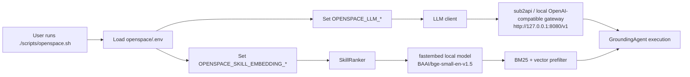
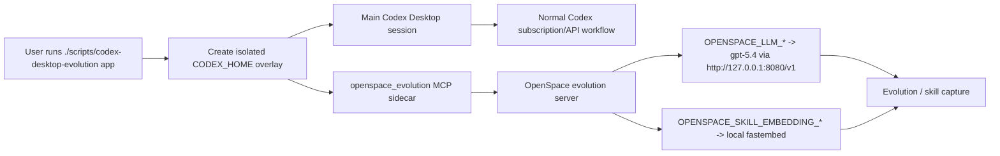
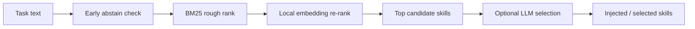

# Current Routing Flow

This document records the current OpenSpace routing setup for this local environment.

## Effective Split Routing

- Main LLM:
  - model: `gpt-5.4`
  - API base: `http://127.0.0.1:8080/v1`
  - source: `OPENSPACE_LLM_*`
- Skill embeddings:
  - backend: `local`
  - model: `BAAI/bge-small-en-v1.5`
  - source: `OPENSPACE_SKILL_EMBEDDING_*`

This means:

- normal OpenSpace generation and tool-calling still use the OpenAI-compatible provider path
- skill-router semantic re-rank does not depend on remote `/v1/embeddings`
- Codex Desktop main session remains isolated from the sidecar/provider env

## Flow 1: OpenSpace CLI

## Flow 2: Codex Desktop With OpenSpace Sidecar

## Flow 3: Skill Routing Internals

## Key Config Inputs

- `OPENSPACE_LLM_API_KEY`
- `OPENSPACE_LLM_API_BASE`
- `OPENSPACE_LLM_OPENAI_STREAM_COMPAT`
- `OPENSPACE_SKILL_EMBEDDING_BACKEND`
- `OPENSPACE_SKILL_EMBEDDING_MODEL`

## Operational Notes

- If the provider does not expose `/v1/embeddings`, the main LLM path still works.
- With the current setup, skill embeddings stay local, so router prefilter remains available.
- If needed later, skill embeddings can be moved to a separate remote endpoint by setting:
  - `OPENSPACE_SKILL_EMBEDDING_BACKEND=remote`
  - `OPENSPACE_SKILL_EMBEDDING_API_KEY`
  - `OPENSPACE_SKILL_EMBEDDING_API_BASE`
  - `OPENSPACE_SKILL_EMBEDDING_MODEL`
